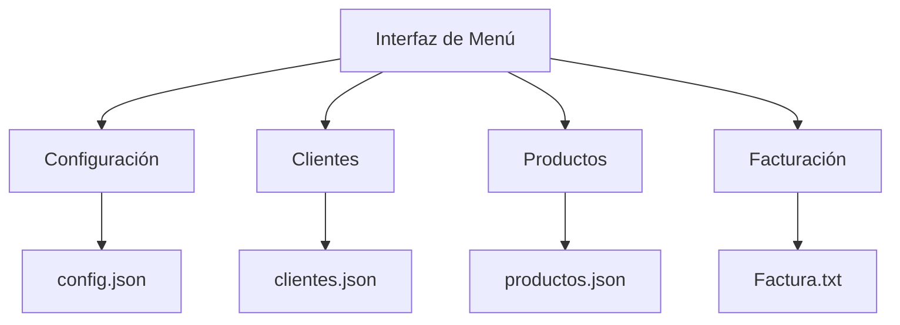

# Documentación del Sistema de Facturación en C++

## 📌 Introducción
Este sistema permite gestionar clientes, productos y generar facturas con cálculos automáticos de IVA. Está desarrollado en C++ y utiliza archivos JSON para almacenar datos.

## 📚 Funciones Externas Utilizadas

### 1. Biblioteca JSON (nlohmann/json)
```cpp
#include "json.hpp"
```
- **Para qué sirve**: Manejar datos en formato JSON (almacenar y leer información)
- **Uso en nuestro código**:
  - Guardar configuraciones del establecimiento
  - Almacenar listas de clientes y productos
  - Generar facturas estructuradas

### 2. Biblioteca iomanip
```cpp
#include <iomanip>
```
- **Para qué sirve**: Formatear salida de texto
- **Uso en nuestro código**:
  - Alinear columnas en las facturas
  - Mostrar precios con 2 decimales (`setprecision(2)`)

### 3. Biblioteca fstream
```cpp
#include <fstream>
```
- **Para qué sirve**: Leer y escribir archivos
- **Uso en nuestro código**:
  - Guardar datos en archivos `.json`
  - Generar facturas en archivos `.txt`

## 🏗️ Estructura del Código

### 1. Estructuras de Datos
```cpp
struct Cliente {
    string nombre;
    string cedula;
    // ... otros campos
};

struct Producto {
    int id;
    string nombre;
    // ... otros campos
};

struct Establecimiento {
    string nombre;
    // ... otros campos
};
```
- **Función**: Modelar la información clave del sistema

### 2. Funciones Principales

#### 🛠️ Configuración
```cpp
void configurarEstablecimiento()
```
- **Qué hace**: Guarda los datos del negocio (nombre, dirección, RUC)
- **Dónde se guarda**: En `config.json`

#### 👥 Gestión de Clientes
```cpp
void guardarCliente()
void listarClientes()
```
- **Qué hacen**:
  - Registrar nuevos clientes (con validación de cédula y correo)
  - Mostrar lista de clientes registrados
- **Dónde se guarda**: En `clientes.json`

#### 📦 Gestión de Productos
```cpp
void guardarProducto()
void listarProductos()
```
- **Qué hacen**:
  - Agregar productos con precio y tipo de IVA
  - Mostrar catálogo completo
- **Dónde se guarda**: En `productos.json`

#### 🧾 Facturación
```cpp
void generarFactura()
```
- **Qué hace**:
  1. Selecciona un cliente
  2. Agrega productos al carrito
  3. Calcula automáticamente:
     - Subtotal
     - IVA (15% para productos marcados)
     - Total
  4. Genera un archivo `.txt` con formato profesional

## 🔄 Flujo de Datos


## 💡 Conceptos Clave de C++ Usados

1. **Manejo de Archivos**:
   - `ofstream`: Para escribir archivos
   - `ifstream`: Para leer archivos

2. **Validaciones**:
   ```cpp
   bool validarCedula() // Verifica 10 dígitos
   bool validarCorreo() // Busca @ y .
   ```

3. **Formateo de Texto**:
   ```cpp
   cout << fixed << setprecision(2); // Para mostrar $10.50
   ```

4. **Manejo de Fechas**:
   ```cpp
   time_t ahora = time(0); // Obtiene fecha actual
   ```

## 🛠️ Cómo Extender el Sistema

1. **Agregar nuevos campos**:
   - Editar las estructuras (ej: agregar "categoría" a Producto)

2. **Nuevas funcionalidades**:
   ```cpp
   void buscarCliente() // Implementar búsqueda
   void hacerDevolucion() // Para manejar devoluciones
   ```

3. **Mejorar interfaz**:
   - Añadir colores con `#include <windows.h>`
   - Crear menús más interactivos

## 📋 Ejemplo de Archivo Generado

**factura_0923456789_15-11-2023.txt**:
```
===================================
**  MI TIENDA EJEMPLO  **
Av. Principal 123 - Quito
Tel: 022345678
===================================
FACTURA
Fecha: 15/11/2023
Cliente: Juan Pérez
Cédula: 0923456789
-----------------------------------
Producto             Precio   IVA   
-----------------------------------
Laptop Gamer         $1200.00 15%   
Mouse inalámbrico    $25.00   -     
-----------------------------------
Subtotal:            $1225.00
IVA (15%):           $180.00
TOTAL:               $1405.00
===================================
```

> 💡 **Tip**: Todos los archivos de datos se guardan en la misma carpeta donde se ejecuta el programa.
```

## 📌 Para Compartir con tu Equipo

1. Guárdalo como `DOCUMENTACION.md`
2. Usa [Markdown Preview](https://marketplace.visualstudio.com/items?itemName=shd101wyy.markdown-preview-enhanced) en VS Code para visualizarlo
3. Incluye ejemplos prácticos de uso:
   - Cómo registrar un cliente
   - Pasos para generar una factura

¿Necesitas que explique alguna parte con más detalle? 😊
